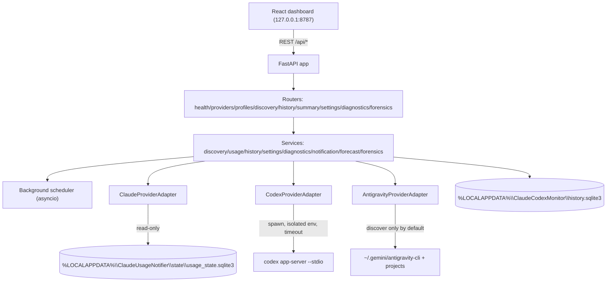

# Claude & Codex Usage Monitor

A local, single-page dashboard that auto-discovers every Claude Code, OpenAI
Codex CLI, Google Antigravity, and Free-AI profile on this Windows machine and shows
real usage limits, history, and forecasts — without ever fabricating a number.

Everything runs on `127.0.0.1` only. Nothing leaves the machine.

## What it does

- Discovers Claude Code profiles (`~/.claude`, `~/.claude-*`, PowerShell
  function-based profile switches like `claude-mt`/`claude-nc`/`claude-personal`)
  and Codex CLI profiles (`~/.codex`, `CODEX_HOME` overrides, named
  `-p/--profile` sub-configs), and Antigravity profiles/projects
  (`~/.gemini/antigravity-cli`, `~/.gemini/antigravity`, app-data homes,
  env/PowerShell overrides, Chromium-style `Default`/`Profile *` dirs, and
  `~/.gemini/config/projects/*.json`), plus the local Free-AI repo.
- Shows current usage per limit window (used/remaining %, reset time, live
  countdown), historical charts, a simple exhaustion forecast, and clearly
  flags stale/unreachable/unauthenticated profiles.
- Adds a zero-token Token Forensics dashboard that passively ingests local
  Codex/Claude JSONL, Free-AI logs, and Antigravity snapshots into searchable
  local evidence tables with raw-event provenance and export controls.
- Stores history locally in SQLite with configurable retention.
- Sends Windows toast notifications at 80%/95%/exhaustion/auth-required/
  repeated-failure/reset-completed thresholds, with dedup so you're never
  spammed for the same event.
- Single process, single port (`8787`): the backend serves both the REST API
  and the built frontend.

## Architecture

```
+-------------------------------------------------------------+
|                     Browser (127.0.0.1:8787)                |
|   React + TypeScript + Vite + Tailwind + Recharts            |
+---------------------------+-----------------------------------+
                            | REST (/api/*)
+---------------------------v-----------------------------------+
|                    FastAPI app (uvicorn, 127.0.0.1 only)      |
|  routers: health, providers, profiles, discovery, history,    |
|           summary, settings, diagnostics, forensics           |
|                                                                |
|  services: discovery / usage / history / settings /           |
|            diagnostics / notification / forecast / forensics  |
|                                                                |
|  scheduler: asyncio background loop (discover -> refresh ->   |
|             periodic refresh, single lock, backoff on error)  |
|                                                                |
|  adapters:                                                    |
|    ClaudeProviderAdapter  -> vendor/claude_statusline/*        |
|      (self-contained discovery; reads sibling                 |
|       claude-usage-notifier's real SQLite state DB read-only) |
|    CodexProviderAdapter   -> vendor/codex_appserver/*          |
|      (self-contained discovery; spawns `codex app-server       |
|       --stdio` live per profile, isolated env, timeout)       |
|    AntigravityProviderAdapter -> vendor/antigravity/*           |
|      (self-contained discovery; interactive `/usage` panel not  |
|       auto-probed by default to avoid burning turns)            |
|                                                                |
|  db: SQLite (own history.sqlite3), WAL mode                   |
+-----------------------------------------------------------------+
```

Mermaid version (renders on GitHub):



## Security model

- Binds to `127.0.0.1` explicitly — never `0.0.0.0`. Verified with
  `netstat -ano` during development that only the loopback address listens.
- No credentials, tokens, `.credentials.json`/`auth.json` contents, or
  cookies are ever read into memory beyond what a health/auth probe needs,
  logged, stored in the database, or returned by any API endpoint.
- Config/home paths are sanitized before display: the OS username segment is
  replaced with `~` or `<user>` (see `sanitize_path` in
  `backend/src/claude_codex_monitor/models/profile.py`).
- Every Codex probe spawns `codex app-server --stdio` with a **structured
  argument list** (never `shell=True` with string concatenation), an
  **explicit timeout** (18s), and an **explicit minimal environment dict**
  built per profile (`build_isolated_env` in
  `vendor/codex_appserver/app_server_client.py`) — only the handful of
  Windows/process vars actually needed, plus that profile's own
  `CODEX_HOME`. No global `os.environ` mutation, no leakage between profiles.
- Diagnostics responses are sanitized: sanitized paths only, short error
  summaries, no raw file contents, no secrets.

## Supported providers

| Provider | Discovery | Usage data source |
|---|---|---|
| Claude Code | Self-contained (`vendor/claude_statusline/discovery.py`, adapted from the sibling `claude-usage-notifier` project) | Reads the sibling `claude-usage-notifier`'s own SQLite state DB read-only, if that separate tool is installed and has captured statusline data. **This dashboard does not itself register a statusline hook** — see Known limitations. |
| Codex | Self-contained (`vendor/codex_appserver/discovery.py`, adapted from the sibling `ai_usage_notifier` project) | Live, on-demand: spawns `codex [--profile X] app-server --stdio` and reads `account/rateLimits/read` over JSON-RPC. |
| Antigravity | Self-contained (`vendor/antigravity/discovery.py`) | Discovers profiles/projects as first-class profiles. Antigravity has an interactive `/usage`/`/quota` panel, but `agy --print /usage` creates a normal Antigravity turn instead of opening that panel, so automatic probing is disabled by default to avoid burning usage. |
| Free-AI | Local repo path (`CCM_FREE_AI_REPO`, default `H:\Projects\AI\Free-AI\Free-AI`) | Zero-token passive monitoring: reads only `config/free-providers.json`, `.env` presence flags, and `artifacts/logs/free-ai-*.log`. It never runs Free-AI, doctor/tests, router, chat completions, or provider APIs. |

## Data quality labels — what verified/derived/estimated/stale/unavailable mean

Every usage number carries a `quality` field. The dashboard never presents a
number without saying how sure it is:

- **verified** — read directly from an authoritative source in this refresh
  cycle (a live Codex app-server probe, or a fresh reading from the Claude
  notifier's DB).
- **derived** — computed from a verified value (e.g. `remaining % = 100 -
  used %`).
- **estimated** — a forecast/extrapolation. Always shown separately from the
  "real" number, and always labeled — a forecast is never merged into
  `used_percent`.
- **stale** — a real reading exists, but it's old enough (>6h for Claude) that
  the source may no longer reflect current usage. The last known value is
  still shown, with its age.
- **unavailable** — no usable data. Shown as "Unavailable" plus a plain-English
  reason (e.g. "Claude usage notifier has not captured any statusline data
  yet for this profile", "Authentication required. Run `codex login`"). The
  dashboard **never** shows `0%` or `100%` to mean "no data" — that would be
  a fabrication.

`max_units` is always `null` today: no provider adapter exposes a real absolute
denominator, so one is never invented. Free-AI may set `used_units` to local
successful router request counts parsed from logs; this is not quota usage.

## Install / dev / prod-local-start

Prerequisites on PATH: **pixi**, **uv**, **pnpm** (Node.js). Windows 11.

`pixi` is the only tool you invoke directly — its tasks in `pixi.toml`
internally call `uv` (backend Python env/deps) and `pnpm` (frontend). Never
run `uv`/`pnpm` yourself unless you're intentionally bypassing the
orchestration layer for debugging.

```powershell
# One-time setup
pixi run sync              # uv sync backend deps into backend/.venv
pixi run install-frontend  # pnpm install in frontend/

# Development (two terminals)
pixi run dev-backend       # uvicorn --reload on 127.0.0.1:8787
pixi run dev-frontend      # vite dev server with /api proxy to 127.0.0.1:8787

# Production-local (single port, single process)
claude-codex-monitor              # same as -on when shell function is installed
claude-codex-monitor -on          # start the dashboard
claude-codex-monitor -off         # stop the dashboard on port 8787
.\start-dashboard.ps1                 # builds frontend if stale, starts backend, opens browser
.\start-dashboard.ps1 -On             # explicit start, same behavior as no params
.\start-dashboard.ps1 -Off            # stop the dashboard on port 8787
.\start-dashboard.ps1 -Rebuild        # force a frontend rebuild
.\start-dashboard.ps1 -NoBrowser      # don't open a browser tab
.\start-dashboard.ps1 -NoRestart      # exit instead of auto-restarting backend
.\start-dashboard.ps1 -RestartDelaySeconds 10  # wait longer between restarts
.\start-dashboard.ps1 -Port 9000      # use a different port
```

Once running: **http://127.0.0.1:8787**

## How discovery works

**Claude**: precedence-ordered sources — default `~/.claude`, process/user/
machine `CLAUDE_CONFIG_DIR`, PowerShell profile scripts that set
`$env:CLAUDE_CONFIG_DIR` inside a function (e.g. this machine's `claude-mt`/
`claude-nc`/`claude-personal` functions), then any `~/.claude-*`/`~/.claude_*`
directory. A candidate must show at least one strong signal
(`settings.json`, `.claude.json`) or three-plus weak signals (`projects`,
`sessions`, `.credentials.json`, etc.) to be accepted — this is what rejects
`.claude-code-ui` and `.claude-shared` on this machine.

**Codex**: default `~/.codex`, `CODEX_HOME` overrides (env + PowerShell
profile parsing), any `~/.codex-*`/`~/.codex_*` directory, plus any
`*.config.toml` found inside a credible home (named `-p/--profile`
sub-profiles). A home is credible if it contains `config.toml`, `auth.json`,
`state_5.sqlite`, `session_index.jsonl`, `version.json`, or any
`*.config.toml`.

**Antigravity**: default `~/.gemini/antigravity-cli` and
`~/.gemini/antigravity`, `%APPDATA%\Antigravity`, `%LOCALAPPDATA%\antigravity`
and `%LOCALAPPDATA%\Antigravity`, likely env overrides
(`ANTIGRAVITY_HOME`, `ANTIGRAVITY_USER_DATA_DIR`, `ANTIGRAVITY_CONFIG_DIR`),
PowerShell `--user-data-dir` / `--profile` hints, Chromium-style profile dirs
(`Default`, `Profile *`) under credible homes, and
`~/.gemini/config/projects/*.json`.

**Free-AI**: default `H:\Projects\AI\Free-AI\Free-AI`, or
`CCM_FREE_AI_REPO` if set. A candidate must contain `package.json`,
`config/free-providers.json`, and `.env.example`.

Adapters do not recursively scan the filesystem or a whole drive — only the
user home (one level) plus explicitly named locations.

## How usage sources are determined

- **Claude**: this dashboard does not talk to `claude.exe` for usage (there is
  no usage subcommand). Instead it reads the real SQLite state database
  written by the separate `claude-usage-notifier` tool's statusline hook, if
  that tool is installed and has captured at least one Pro/Max rate-limit
  reading for a profile. Read-only by default; a narrow `reset_confirmed`
  write-back capability exists (`state_reader.mark_reset_confirmed_seen`) but
  isn't wired into the refresh path in this version.
- **Codex**: this dashboard spawns `codex app-server --stdio` itself, live,
  on every refresh, and reads `account/rateLimits/read`. This is real,
  active probing — no separate tool required.
- **Antigravity**: this dashboard discovers Antigravity profiles/projects.
  Antigravity has `/usage` and `/quota` in the interactive CLI, but those slash
  panels are not exposed by `agy --print`; using `agy -p /usage` creates a
  normal Antigravity turn and returns agent text. To avoid burning quota on
  every refresh, automatic Antigravity usage probing is disabled by default.
  The parser understands the interactive `Models & Quota` panel text. For safe
  monitoring, put copied panel text in `~/.gemini/antigravity-cli/usage.txt`,
  or set `CCM_ANTIGRAVITY_USAGE_SNAPSHOT` to another text file path. Set
  `CCM_ANTIGRAVITY_USAGE_COMMAND=1` only if you want to try the experimental
  print-mode parser.
- **Free-AI**: this dashboard reads the local Free-AI provider config,
  `.env` key presence, and router logs. It reports successful local
  provider/model request counts from `artifacts/logs/free-ai-*.log`.
  It never copies API keys into this monitor, never prints secret values, and
  never calls `free-ai-doctor`, `free-ai-test`, the router, chat completions,
  or provider APIs.

## Troubleshooting

- **A Claude profile always shows "Unavailable"**: the sibling
  `claude-usage-notifier` isn't installed, or its statusline hook hasn't run
  yet for that profile (rate limits only appear for Pro/Max accounts, only
  after the first API response in a session). Check the Diagnostics drawer
  for the exact reason.
- **A Codex profile shows "Authentication required"**: run `codex login`
  (optionally with `--profile <name>`) for that profile, then refresh.
- **A Codex profile times out**: the `app-server` probe has an 18s timeout;
  a slow/unresponsive `codex.exe` will surface as an error in Diagnostics,
  not silently as 0%.
- **An Antigravity profile shows "Unavailable"**: discovery worked, but the
  interactive `/usage` panel is not available through `agy --print`. Open
  Antigravity CLI and run `/usage` or `/quota`, then put copied panel text in
  `~/.gemini/antigravity-cli/usage.txt` if you want the dashboard to parse it.
- **A Free-AI profile shows "Unavailable"**: discovery worked, but no local
  `artifacts/logs/free-ai-*.log` success entries exist yet. Run Free-AI
  normally; the monitor will read the logs on the next refresh without using
  tokens.
- **Dashboard is slow to refresh**: Windows toast notifications
  (`win11toast`) are fired on a background thread so they never block a
  refresh; if you still see slowness, check `refresh_log` via the DB or
  Diagnostics for the specific profile.

## Testing

```powershell
pixi run test-backend      # pytest (54 tests: discovery, dedup, env isolation,
                            #   parsing, reset-cycle detection, history,
                            #   forecast, sanitization, API endpoints)
pixi run test-frontend     # vitest (component/unit tests)
pixi run e2e-frontend      # Playwright e2e, uses CLAUDE_CODEX_MONITOR_FAKE_ADAPTERS=1
                            #   so it never touches real ~/.claude, ~/.codex,
                            #   or spawns codex.exe
pixi run lint-backend      # ruff
pixi run typecheck-backend # pyright
```

Frontend also has `pnpm lint` (oxlint) and `tsc -b` wired into `pnpm build`.

## DB location, history, backup, deletion

- Own SQLite DB: `%LOCALAPPDATA%\ClaudeCodexMonitor\history.sqlite3` (WAL
  mode). Override with `CCM_DATA_DIR`.
- Tables: `providers`, `profiles`, `usage_snapshots`, `settings`,
  `refresh_log`, `sent_notifications`. See
  `backend/src/claude_codex_monitor/db/schema.sql` for the full schema.
- Forensic tables are prefixed with `forensic_` in the same SQLite DB.
  See `docs/forensic-monitoring.md` for the passive-source support matrix,
  token-quality semantics, export behavior, and zero-token audit.
- Retention: configurable in Settings (`history_retention_days`, default 90).
  A sweep runs at most once every 24h and **always writes a `refresh_log` row
  before deleting anything**.
- Manual full-history delete: `DELETE /api/history` requires
  `?confirm=true` (or `{"confirm": true}` in the body) — a bare `DELETE`
  returns `400`. This also logs to `refresh_log` first.
- To back up: copy `history.sqlite3` (and its `-wal`/`-shm` siblings if
  present) while the app is stopped, or use SQLite's online backup API.

## How to disable/remove

- Stop the dashboard: `claude-codex-monitor -off`, `.\start-dashboard.ps1 -Off`,
  close the terminal running `start-dashboard.ps1`, or press `Ctrl+C`.
- Delete `%LOCALAPPDATA%\ClaudeCodexMonitor\` to remove all local data
  (history, settings, notification dedup state).
- Delete this repository directory. Nothing is installed system-wide, no
  scheduled task, no service, no registry changes.

## API summary

All endpoints are under `/api`. Full request/response shapes are enforced by
Pydantic models in `backend/src/claude_codex_monitor/models/`.

| Method | Path | Purpose |
|---|---|---|
| GET | `/api/health` | Liveness check |
| GET | `/api/providers` | List providers (claude, codex, antigravity, free_ai) |
| GET | `/api/profiles` | List discovered profiles + status |
| POST | `/api/discovery/refresh` | Re-run discovery |
| POST | `/api/profiles/{profile_key}/refresh` | Refresh one profile |
| POST | `/api/refresh-all` | Refresh every active profile |
| GET | `/api/profiles/{profile_id}/limits` | Latest known limits for a profile |
| GET | `/api/history` | Historical snapshots (filters: provider, profile_key, window_id, range) |
| GET | `/api/summary` | Dashboard summary counters |
| GET/PATCH | `/api/settings` | Read/update settings |
| GET | `/api/diagnostics/{profile_key}` | Sanitized diagnostics for one profile |
| POST | `/api/forensics/refresh` | Passive local forensic ingestion; no model/API generation |
| GET | `/api/forensics/overview` | Counts, expensive turns, repeated context, zero-token counters |
| GET | `/api/forensics/sessions` | Paginated forensic session list |
| GET | `/api/forensics/sessions/{session_id}` | Bounded forensic detail for one session |
| POST | `/api/forensics/export` | Local summary/full forensic ZIP export |
| DELETE | `/api/history` | Delete all history (`confirm=true` required) |

## Provider adapter interface

Every adapter (`backend/src/claude_codex_monitor/adapters/base.py`)
implements:

```python
discover_profiles() -> list[ProfileStatus]
validate_profile(profile) -> tuple[bool, str]
fetch_usage(profile) -> Any            # raw, provider-specific
parse_usage(profile, raw) -> list[UsageLimit]   # never fabricates
get_account_metadata(profile) -> dict  # non-secret only
diagnose_error(profile, error) -> ProfileDiagnostics  # sanitized
```

## Known provider limitations

- **Claude**: usage data quality depends entirely on whether the separate
  `claude-usage-notifier` tool is installed and its statusline hook has run.
  This dashboard does not (in this version) register its own statusline hook
  — it's a design tradeoff documented in the code
  (`adapters/claude_adapter.py`) to prioritize self-contained discovery over
  full self-contained usage capture given time constraints.
- **Codex**: only the `primary` rate-limit window is reliably present in
  practice; `secondary` is often absent and is correctly reported as
  unavailable, never a fabricated 0%.
- **Free-AI**: no provider quota percentages are probed. Only local successful
  router request counts are shown.
- Forecasts are simple linear extrapolations over the current reset cycle
  and require at least 3 verified readings — they are not a statistical
  model and should be treated as a rough guide only.

## Repository layout

```
backend/src/claude_codex_monitor/   FastAPI app, adapters, services, DB, vendor/
backend/tests/                      pytest unit + API tests, sanitized fixtures
frontend/src/                       React + TS dashboard
frontend/e2e/                       Playwright e2e (fake-adapter backed)
pixi.toml                           Task orchestration (wraps uv + pnpm)
start-dashboard.ps1                 Production-local launcher
.env.example                        Optional environment overrides
```
